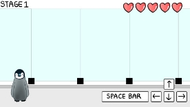

2022년도 2학기 캡스톤 디자인Ⅰ 기획서

20141728 김용현

20193496 나용성

20193512 김민서

20203428 김민솔

◼ 기획의 주제와 목표

\1. 기획의 주제

Unity 엔진을 활용한 2D 플랫폼 게임 제작

\2. 기획의 목표

` `1) 총 3 스테이지로 구성된 2D 플랫폼 게임을 제작한다. 

` `2) 각 스테이지 마다 컨셉에 맞는 방해 요소들과 보스를 설정한다. 

` `3) 보스전은 비전투 방식으로, 정해진 시간 동안 보스의 패턴을 피해서 생존하면 클리어하는   방식으로 진행되게 한다.

` `4) 스테이지에서의 남은 시간과 체력에 따라 스코어를 얻게 한다.

\3. 게임 이름 : 동물원 대탈출

\4. 게임 장르 : 2D 플랫폼 게임

\5. 게임 플랫폼 : PC

\6. 게임 내용 : 주인공인 아기 펭귄이 동물원을 나와 남극으로 가는 과정이다. 게임 시작 시 간단하게 조작법을 설명하고 진행한다. 각 스테이지 별로 제한 시간이 있고 시간 내에 목표 지점을 도달하면 보스가 나타난다. 보스와는 전투를 직접 하는 것이 아닌 정해진 시간 동안 보스의 공격 패턴을 회피하면 클리어가 되는 방식으로 진행된다. 각 스테이지마다 컨셉에 알맞은 장애물들을 배치하고 그 장애물들을 극복하기 위한 기능(2단 점프, 슬라이딩 등)들도 구현한다.

◼ 그래픽 화면 구성(콘티)

◼ 프로그래밍 기능 블록

◼ 게임적 요소들

\1. 게임의 밸런스

스테이지가 진행됨에 따라 난이도가 상승하게 하고 이에 따른 플레이어의 컨트롤 숙련도를 요구한다.

\2. 스테이지

` `1) 총 3스테이지로 나뉘고 각각 스테이지마다 컨셉이 있다.

|챕터|컨셉|방해 요소|보스|
| :-: | :-: | :-: | :-: |
|1|동물원|사육사가 던지는 물고기, 다른 동물들, 관람객 등|원숭이|
|2|도심|
사람들의 이동수단(자동차, 킥보드), 펭귄을 노리는 어린이, 

도심에서 사는 동물(까마귀), 카메라로 펭귄을 찍는 사람 등
|길고양이|
|3|남극|미끄러지고 부서지는 얼음 바닥, 남극 동물들(범고래) 등|바다표범|

` `2) 스테이지 설명

`  `① 남극으로 떠나고 싶은 아기 펭귄이 동물원을 나와서 도심을 지나 마지막엔 남극에 도달       하는 내용이다.

`  `② 스테이지 1 : 동물원

`     `동물원을 나가야 하는 펭귄을 사육사가 던진 물고기와 다른 동물들이 방해를 한다.

`     `관람객들이 펭귄의 이목을 끌기 위해 유리창을 칠때 마다 게임화면이 흔들리고 펭귄이        미끄러지게 구현할 것이다.

`     `첫 번째 보스는 원숭이이고 바나나를 던지거나 시끄럽게 소리를 지르는 등의 패턴이 만       들어질 예정이다.

`  `③ 스테이지 2 : 도심

`     `동물원을 나온 펭귄이 향한 곳은 도심지이다. 이 곳에선 길거리에 지나다니는 자동차와        하늘에서 돌맹이를 떨어트리는 까마귀, 펭귄을 비비탄 총으로 겨냥하는 어린이 등이 방해       요소로 등장할 예정이고 카메라로 펭귄을 촬영하는 사람이 등장해 플래시를 터트릴 때        화면이 순간적으로 반짝거리는 효과를 줄 것이다.

`     `두 번째 보스는 길고양이이며 날렵하게 달려는 패턴이나 가까이 붙어서 앞발로 연속으로

`     `공격하는 등의 패턴을 만들 것이다.

`  `④ 스테이지 3 : 남극

`     `결국 남극에 도착한 펭귄은 다른 펭귄 무리들이 있는 곳을 찾아 나선다. 이 스테이지에선

`     `미끄러지는 바닥과 부서지는 발판, 그리고 범고래와 같은 펭귄을 위협하는 동물들이 방해       요소로 등장할 예정이다.

`     `마지막 보스는 바다 표범이며 펭귄을 계속해 쫓아오면서 진행될 예정이다. 바다 표범의        공격 패턴과 스테이지의 장애물들을 동시에 피하면서 마지막 스테이지인 만큼 난이도를       어렵게 조정할 예정이다.

`  `⑤ 엔딩 : 남극에서 다른 펭귄 무리와 만난 주인공은 오로라 아래에서 여태까지의 무용담을       늘어 놓으면서 끝이 난다.

\3. 차별점

` `1) 스테이지를 진행하는 것은 여타 플랫폼 게임과 비슷하나, 보스전을 두고 그 보스와 전투하   는 것이 아니라 정해진 시간 동안 보스의 공격 패턴을 피해 생존시, 클리어가 되는 방식이다.

` `2) 얼음맵, 용암맵, 사막맵 등 타일 느낌만 바꾸고 장애물은 그대로인 플랫폼 게임과 차별을    두기 위해서 스토리 라인에 따라 스테이지가 변하고 스테이지의 컨셉에 맞게 방해 요소와 보   스들을 배치한다.

\4. 게임의 재미 요소

보스의 난이도를 높게 설정해 플레이어가 컨트롤을 하는 재미가 있게 한다. 그리고 게임에 등장하는 동물들의 특성을 잘 표현해 시각적인 재미까지 줄 수 있도록 할 것이다.

ex) 펭귄의 배 슬라이딩, 길거리에 펭귄이 나타났는데 카메라부터 들이미는 사람 등

◼개인별 업무와 개발 일정

|**이름**|**수행내용**|**역할**|
| :-: | :-: | :-: |
|김용현|
- 레벨 디자인

- 플레이어 캐릭터 기능 구현
|팀장|
|나용성|- 보스 구현|팀원|
|김민서|- 스테이지 장애물 구현|팀원|
|김민솔|- 그래픽 디자인|팀원|

※ 개인별 일정표

|주차|김용현|나용성|김민서|김민솔|
| :-: | :-: | :-: | :-: | :-: |
|6|플레이어 캐릭터 구현|보스 1 과일던지기|스테이지 1 사육사|보스 1 그래픽|
|7|스테이지 1 발판배치|보스 1 바나나던지기|스테이지 1 관람객|스테이지 1 그래픽|
|8|스테이지 1 장애물배치|보스 1 소리지르기|스테이지 2 까마귀|스테이지 1 배경|
|9|스테이지 2 발판배치|보스 2 태클|스테이지 2 어린이|보스 2 그래픽|
|10|스테이지 2 장애물배치|보스 2 할퀴기|스테이지 2 카메라|스테이지 2 그래픽|
|11|스테이지 2 테스트|보스 2 컵 떨어트리기|스테이지 2 까마귀||
|12|스테이지 3 얼음벽배치|보스 3 박치기|스테이지 3 범고래|스테이지 2, 3 그래픽|
|13|스테이지 3 장애물배치|||스테이지 3 보스|
|14|스테이지 3 테스트|디버깅|디버깅|스토리 카툰 제작|

※ 개인별 작업 내용 머지 일정

|주차|머지 계획|
| :-: | :-: |
|8|
중간 발표까지 스테이지 1을 완성하기위해 그래픽, 보스씬, 장애물과 스테이지 작업물을 모두 합쳐

스테이지 1을 완성
|
|10|그래픽, 장애물이 하나하나 완성 될 때마다 합쳐서 테스트|
|11||
|12|스테이지 2 보스가 완성되면 스테이지 2를 완성|
|13|
스테이지 3의 작업물들을 합쳐 스테이지3을 완성
|
|14|
스테이지 연결 만화를 사이에 넣는다.
|

◼ 예상되는 어려움과 해결방안

\1. 깃허브를 통한 협업, 애셋 스토어 이용 등 처음하는 것들을 알게 되는 과정

해결방안) 앞으로 당연하게 할 수 있어야 하는 것들이니, 이번 기회에 인터넷 검색이나 주변사람들에게 잘 물어봐서 앞으로 제대로 사용할 수 있게 한다.

\2. 팀원 간에 이해할 수 있게 코드 짜기 / 변수, 함수 네이밍 등

해결방안) 회의를 거쳐 클래스 다이어그램을 만들고 그대로 만들어 가면서 진행한다. 진행   중간 마다 서로의 코드를 리뷰해주고 의견을 나눈다.

\3. 그래픽 담당이 1명이라 업무량 부담인점

해결방안) 회의비보다는 애셋구매에 지원금의 대부분을 투자하고 그래픽을 직접 도와줄순 없으나 해당 팀원에게 도움이 될 레퍼런스를 다같이 찾아 준다.

\4. 보스의 공격 패턴 밸런싱

해결방안) 여러 가지 게임등을 참고해서 보스 패턴을 구현하고 발동될 확률을 적절히 분배한다. 

◼ 깃허브 마스터 링크

[https://github.com/YoungHyun1728/2022-2-Capstone-Design](http://github.com/YoungHyun1728/2022-2-Capstone-Design)
